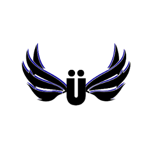
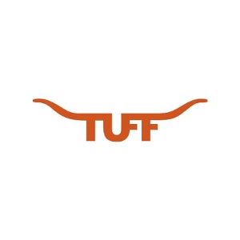
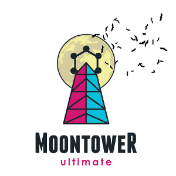

% Etc.

# Other stuff I do

--------------------------------------------------------------------

I spend a lot of time playing ultimate frisbee. Most recently I played with Pixel, a mixed club team in Detroit, MI. In past years I played with Moontower, a mixed team in Austin, TX. I also played for one year on TUFF, the University of Texas men's team, and for four years on Süperfly, the Yale college men's team.

In grad school I also co-organized the University of Texas math department's IM ultimate team, SO(2). We won the intramural championship on April 14, 2022 (incidentally, the same day that I defended my PhD thesis.)

Back in 2017 I wrote some [articles](frisbee) for the team on basic frisbee strategy.

--------------------------------------------------------------------

Sometimes I also work on small programming projects. You can see a few of them on [my GitHub](https://github.com/tjweisman/).

 - [Geometry Tools](geometry_tools)

 - [Dixit](dixit/) (note - this is currently defunct.)

 - [How to play *Let it Ride* optimally](frisbee/let_it_ride.html)

 - [Is it a horse, or is it a frisbee team?](frisbee/horseorfris/)

-------------------------------------------------------------------------

My friends and I sometimes read short stories together! [Neža Žager Korenjak](https://web.ma.utexas.edu/users/nezz.zk/index.html) is our main organizer and keeps a [list](https://web.ma.utexas.edu/users/nezz.zk/story.html) of the stories we've read in our club so far. [Casandra Monroe](https://sites.google.com/utexas.edu/cmonroe/) also keeps a [list](https://sites.google.com/utexas.edu/cmonroe/short-story-club) (also featuring song pairings for each story).
