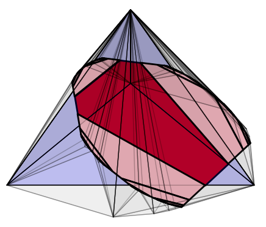

% Home
% index_template.html

About me
===========

I'm Teddy, an NSF Postdoctoral Fellow in mathematics at the University of Michigan. Currently my research interests are in geometric structures on manifolds, discrete subgroups of Lie groups, and geometric group theory. My postdoctoral mentor at Michigan is [Ralf Spatzier](https://dept.math.lsa.umich.edu/~spatzier/).

Previously, I spent a year as a postdoc at the Max Planck Institute for Mathematics in the Sciences in Leipzig, Germany, working in the research group of [Anna Wienhard](https://www.mathi.uni-heidelberg.de/~wienhard/). I completed my PhD in 2022 at the University of Texas at Austin, where my advisor was [Jeff Danciger](https://web.ma.utexas.edu/users/jdanciger/index.html).

*************************************

## Contact

Pronouns: he/him

Email: [tjwei@umich.edu](mailto:tjwei@umich.edu)

*************************************

## Upcoming

Young researchers workshop at [*20 Years of Anosov Representations*](https://www.mis.mpg.de/events/series/20-years-of-anosov-representations):
 
October 7-11, 2024 in Leipzig, Germany

*************************************

If you are interested in drawing nice pictures of the hyperbolic plane and projective space, check out my [geometry_tools](geometry_tools) Python package!

*************************************

	

