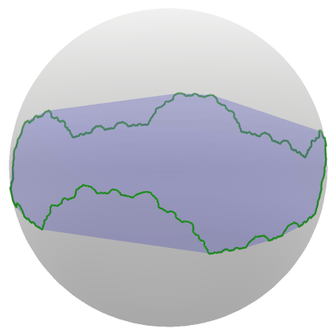
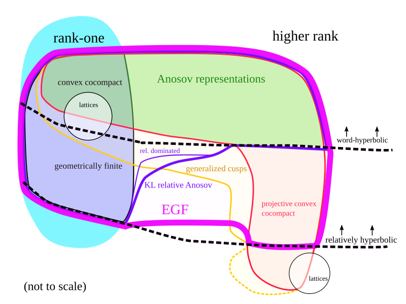
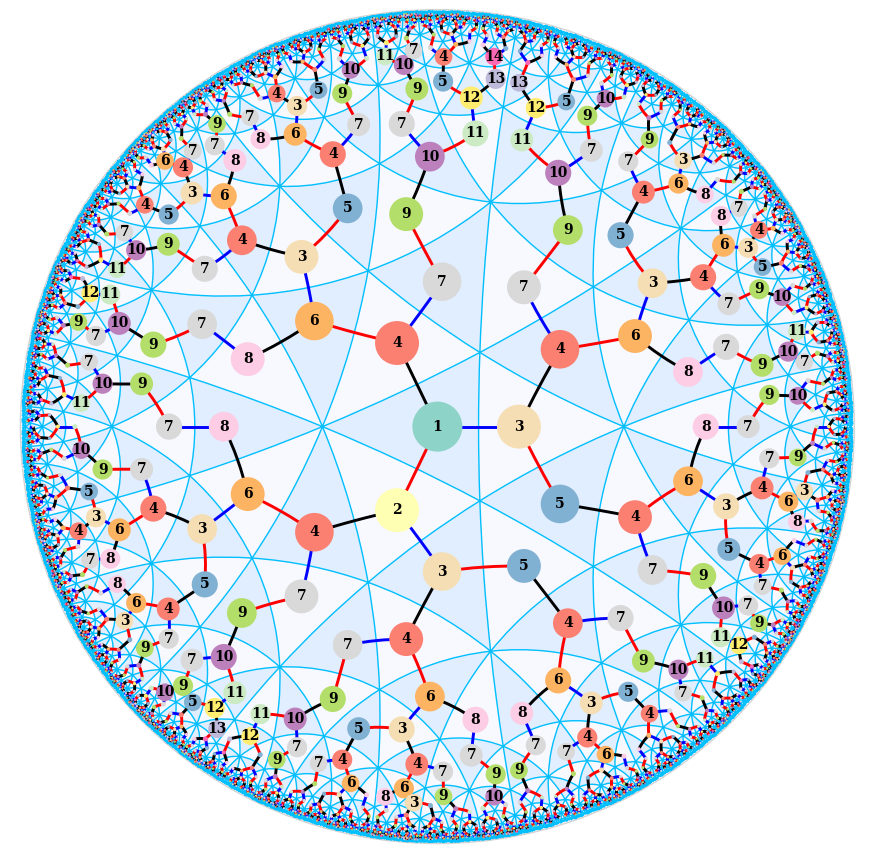
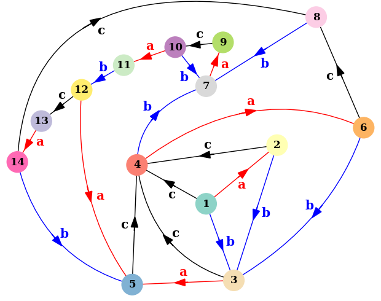
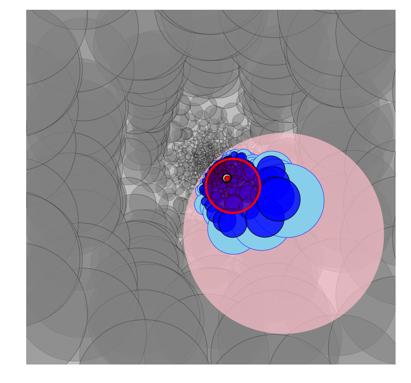
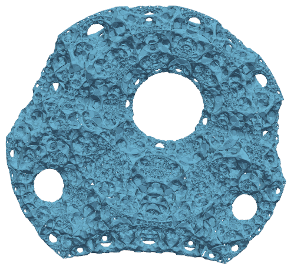

% Research

Research
==========

My research is about the interaction between geometric structures on manifolds, geometric group theory, and discrete subgroups of Lie groups. The relationship between these three areas is quite strong in the classical context of *convex cocompact* and *geometrically finite* representations. These are representations of word-hyperbolic (or relatively hyperbolic) groups into rank-one Lie groups (such as PSL(2, R) and PSL(2, C)) which behave well with respect to both the coarse geometry of the represented group and the smooth geometry of the target group.

I am particularly interested in the geometry and dynamics of higher-rank generalizations of convex cocompactness and geometrical finiteness, including (but not limited to) Anosov representations. Many of the examples I work with come from convex projective structures on manifolds, and are often inspired by hyperbolic geometry.

The limit set of a convex cocompact representation in hyperbolic space (specifically, a quasifuchsian representation produced by bending). See an <a href="resources/bending2.gif">animated version</a>.

## Recent publications and preprints

1. (with A. Guilloux) *Limits of limit sets in rank-one symmetric spaces*. arXiv:2407.04301, 2024.

	[download](papers/rank1_limit.pdf) | [arXiv]((https://arxiv.org/abs/2407.04301)

2. (with M. Islam) *Morse properties in convex projective geometry*. arXiv:2405.03269, 2024. Submitted.

	[download](papers/morse_properties.pdf) | [arXiv](https://arxiv.org/abs/2405.03269)

3. (with K. Mann and J.F. Manning) *Topological stability of relatively hyperbolic groups acting on their boundaries*. arXiv:2402.06144, 2024. Submitted.

	[download](papers/stable_with_parabolic.pdf) | [arXiv](https://arxiv.org/abs/2402.06144)

4. *Examples of extended geometrically finite representations.* arXiv:2311.18653, 2023.

	[download](papers/egf_examples.pdf) | [arXiv](https://arxiv.org/abs/2311.18653)

3. (with S. Douba, B. Fléchelles, and F. Zhu) *Cubulated hyperbolic groups admit Anosov representations.* arXiv:2309.03695, 2023. Submitted.

	[download](papers/anosov_cubulated.pdf) | [arXiv](https://arxiv.org/abs/2309.03695)

3. (with A. Traaseth) *Combination theorems for geometrically finite convergence groups.*  arXiv:2305.08011, 2023. Submitted.

	[download](papers/combination_convergence.pdf) | [arXiv](https://arxiv.org/abs/2305.08011)

4. (with K. Mann and J.F. Manning) *Stability of hyperbolic groups acting on their boundaries.* arXiv:2206.14914, 2022. Submitted.

	[download](https://pi.math.cornell.edu/~jfmanning/research/stable93.pdf) | [arXiv](https://arxiv.org/abs/2206.14914)

5. *An extended definition of Anosov representation for relatively hyperbolic groups*. arXiv:2205.07183, 2022. Submitted.

	[download](papers/extended_relative_anosov.pdf) | [arXiv](https://arxiv.org/abs/2205.07183)

6. *Dynamical properties of convex cocompact actions in projective space*. J. Topol., 16(3):990-1047, 2023. 

	[journal](https://doi.org/10.1112/topo.12307) | [download](papers/convex_cocompact_dynamics.pdf) | [arXiv](https://arxiv.org/abs/2009.10994)

[**PhD thesis:**](papers/thesis.pdf) *Higher-rank generalizations of convex cocompact and geometrically finite dynamics*.

Part of the landscape of discrete subgroups of Lie groups with "intermediate" behavior between rank-one and higher rank. EGF representations are introduced in my <a href="https://arxiv.org/abs/2205.07183">paper</a> "An extended definition of Anosov representation for relatively hyperbolic groups." 

## Talk slides and videos

Combination theorems for geometrically finite convergence groups ([NCNGT](https://www.ncngt.org/topic-groups/lie-groups), June 2023) 
[video (part 1)](https://youtu.be/vvAQ6tRbTK0) | [video (part 2)](https://youtu.be/lHSLgRjo3es)

Topological stability for (relatively) hyperbolic boundary actions (GTiNY, June 2023) 
[slides](resources/talks/gtiny2023.pdf)

Extended geometrically finite representations (STDC, March 2022)  
[slides](resources/talks/stdc2022_handout.pdf)

Extended convergence dynamics and relative Anosov representations (December 2021)  
[slides](resources/talks/rel_anosov_heidelberg.pdf)	

Expansion/contraction dynamics for non-strictly convex projective manifolds (GTA Philadelphia, June 2021)  
[slides](resources/talks/temple_2021_flat.pdf)

Group actions on boundaries of convex divisible domains (November 2019)  
[slides](resources/talks/gainesville_2019.pdf)

## Gallery

### Coxeter automaton

A shortlex <a href="https://en.wikipedia.org/wiki/Automatic_group">automatic structure</a> for a (3,3,4) triangle group in the hyperbolic plane, drawn using my <a href="geometry_tools">geometry_tools</a> Python package. Each numbered vertex is a state in a finite state automaton, generated using the <a href="https://gap-packages.github.io/kbmag/">kbmag program</a>.

This image was originally created for the <a href="https://www.ncngt.org/postcards">postcard session</a> of the 2021 <a href="https://www.ncngt.org/">Nearly Carbon Neutral Geometric Topology</a> conference.

### Figure-eight knot group automaton

Local structure of a finite-state "relative automaton" recognizing quasi-geodesics in the figure-eight knot group. This is an practical implementation of the construction used in <a href="https://arxiv.org/abs/2205.07183">arXiv:2205.07183</a> to prove relative stability properties of extended geometrically finite representations.

### Pontryagin sphere

An approximation of the limit set of a convex cocompact reflection group in O(4,1), studied by <a href="https://www.ihes.fr/~/douba/">Sami Douba</a> and <a href="https://sites.google.com/view/lorenzo-ruffoni">Lorenzo Ruffoni</a>. The limit set of this group is a Pontryagin sphere, embedded equivariantly into the ideal boundary of 4-dimensional hyperbolic space (a 3-sphere). 
<a href="resources/pontryagin_anim.gif">Animated version</a> (41MB file) | <a href="pontryagin_interactive.html">Interactive version</a> (5MB file, less detail)

