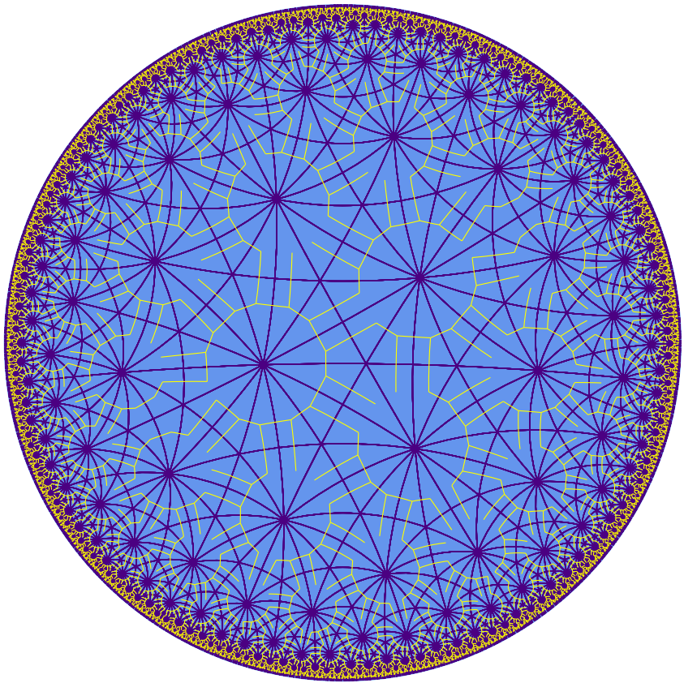

% Etc.

I spend a lot of time playing ultimate frisbee. I've played three seasons with Moontower, a mixed club team here in Austin, TX. Previously I played for one year on TUFF, the University of Texas men's team, and for four years on Süperfly, the Yale college men's team.

I also co-organize (along with [Richard Wong](https://web.ma.utexas.edu/users/richard.wong/)) the math department IM ultimate team, SO(2). I wrote some [articles](frisbee) for the team on basic frisbee strategy.

--------------------------------------------------------------------

Sometimes I also work on small programming projects. You can see a few of them on [my GitHub](https://github.com/tjweisman/).

[Geometry Tools](geometry_tools_usage.html)

[Dixit](dixit/)

[How to play *Let it Ride* optimally](frisbee/let_it_ride.html)

[Is it a horse, or is it a frisbee team?](frisbee/horseorfris/)

A shortlex [automatic structure](https://en.wikipedia.org/wiki/Automatic_group) for a [(2,3,7) triangle group](https://en.wikipedia.org/wiki/(2,3,7)_triangle_group) in the hyperbolic plane. The yellow edges give a spanning tree for the Cayley graph of the group. Paths in the tree starting at the identity represent accepted words.