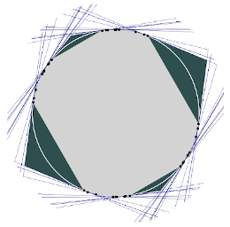
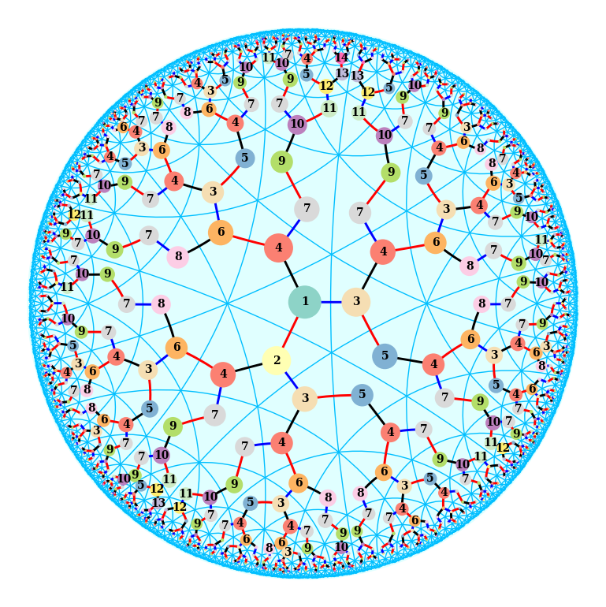
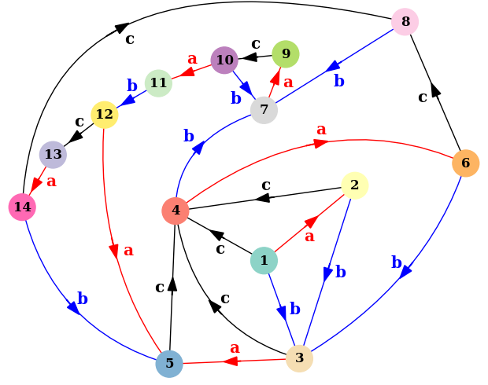

% Research

Research
==========

My research is about the interaction between geometric group theory and geometric structures on manifolds. Mainly this means that I use ideas in geometric group theory to understand interesting discrete subgroups of Lie groups. In particular I'm interested in convex cocompact group representations. These are representations of word-hyperbolic groups into rank-one Lie groups which behave well with respect to both the coarse geometry of the represented group and the smooth geometry of the target group.

I'm especially interested in generalizations of convex cocompactness in higher rank, for instance Anosov representations, and currently I am thinking about notions of convex cocompact representations (and Anosov representations) that make sense for groups which are not necessarily word-hyperbolic. Many of the examples I work with come from convex projective structures on manifolds, and are often inspired by hyperbolic geometry.

--------------------------------------------------------------

## Preprints

1. *Relatively stable families of discrete relatively hyperbolic groups*. (in preparation)

2. *Dynamical properties of convex cocompact actions in projective space*. [arXiv:2009.10994](https://arxiv.org/abs/2009.10994).

## Talks

1. May 2021, GTA Philadelphia.
*Expansion/contraction dynamics for non-strictly convex projective manifolds.* [Slides](resources/talks/temple_2021_flat.pdf)

2. November 2019, AMS Southeastern Sectional Meeting: Special Session on Geometric Structures on Manifolds.
*Group actions on boundaries of convex divisible domains.* [Slides](resources/talks/gainesville_2019.pdf)

## Publications

1. *Realization of Groups with Pairing as Jacobians of Finite Graphs* (with L. Gaudet, D. Jensen, D. Ranganathan,
and N. Wawrykow). Annals of Combinatorics, 22.4 (2018), pp 781-801.

A shortlex <a href="https://en.wikipedia.org/wiki/Automatic_group">automatic structure</a> for a (3,3,4) triangle group in the hyperbolic plane, drawn using my <a href="geometry_tools_usage.html">geometry_tools</a> Python package. Each numbered vertex is a state in a finite state automaton, generated using the <a href="https://gap-packages.github.io/kbmag/">kbmag program</a>.

